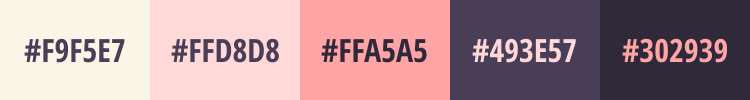

<div align="center">
  

<sub>Created by **_[@Brunastephane](https://github.com/brunastephane)_**</sub>

</div>

# Tools

<div align="center">

| ReactJS                                                                                                          | Typescript                                                                                                     | Material Ui                                                                                                       | Sass                                                                                                  | Docker                                                                                                          | NPM                                                                                            |
| ---------------------------------------------------------------------------------------------------------------- | -------------------------------------------------------------------------------------------------------------- | ----------------------------------------------------------------------------------------------------------------- | ----------------------------------------------------------------------------------------------------- | --------------------------------------------------------------------------------------------------------------- | ---------------------------------------------------------------------------------------------- |
|  |  |  |  |  |  |

</div>

# Color Palette

<p align="center">
  
</p>

# Pre-Requisites

- [NVM](https://github.com/nvm-sh/nvm)
- [Mini-Project-API](https://github.com/brunastephane/mini-project-api)

# Getting Started

- Create a file called <code>.env</code> and copy the content from <code>.env.template</code>
- Replace the values for the ones to match with your configuration

```bash
$ nvm use
$ npm i
$ npm start
```
